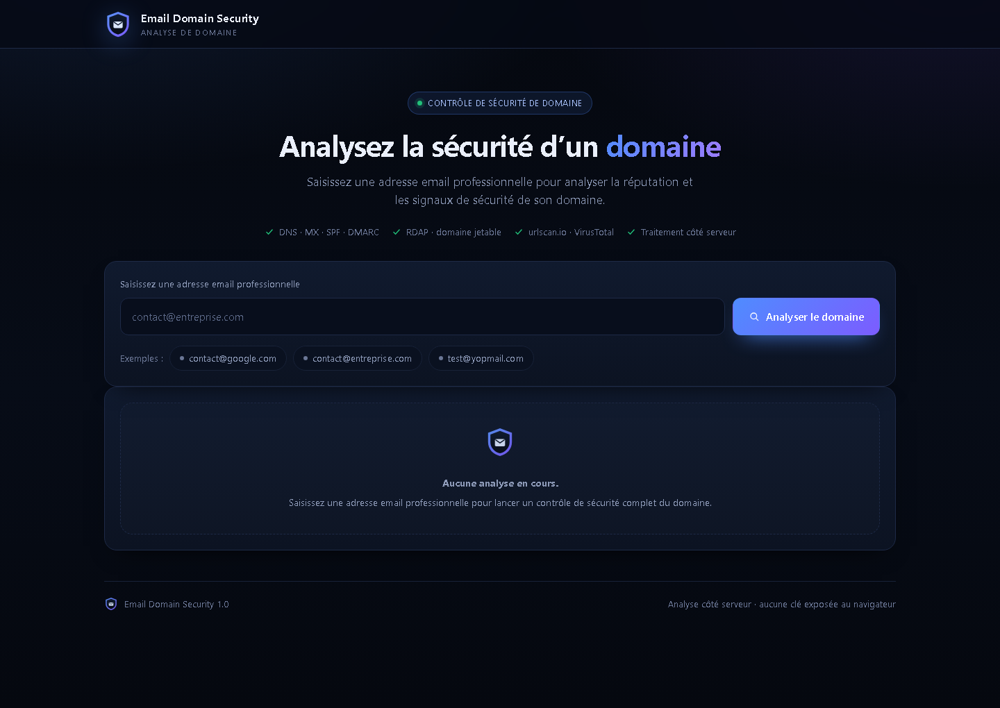
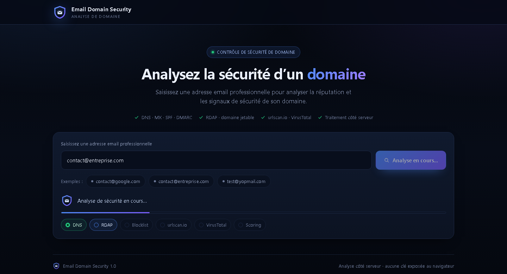
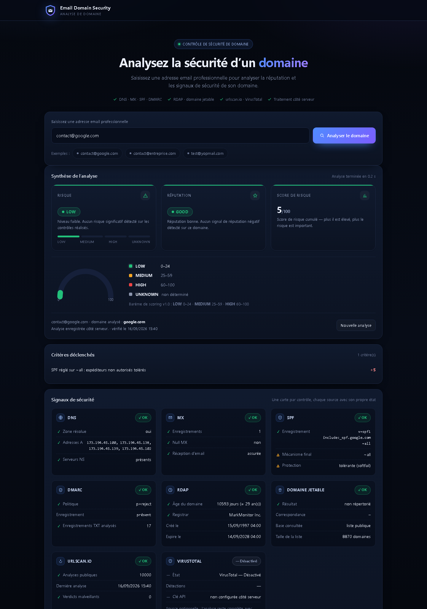
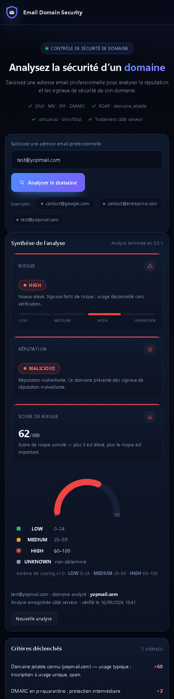

# Email Domain Security

Application web qui analyse la sécurité et la réputation du domaine associé à une
adresse e-mail professionnelle.

Une adresse peut sembler professionnelle alors que son domaine présente des signaux
de risque. L'application extrait le domaine, interroge plusieurs sources techniques
indépendantes, applique un barème de risque et produit un rapport lisible.

Version **1.0** — en production : <https://mon-projet-weld.vercel.app>

---

## 1. Problème résolu

Une adresse e-mail ne dit rien, à elle seule, de la fiabilité de son domaine.
Email Domain Security vérifie :

- la configuration **DNS** (résolution, enregistrements A et NS) ;
- les enregistrements **MX** (le domaine peut-il recevoir du courrier ?) ;
- **SPF** (mécanisme final : `-all`, `~all`, `+all`) ;
- **DMARC** (politique `p=none`, `p=quarantine`, `p=reject`) ;
- les informations **RDAP** : date de création, âge du domaine, registrar ;
- la présence du domaine dans une **blocklist de domaines jetables** ;
- les informations publiques disponibles sur **urlscan.io** ;
- **VirusTotal**, lorsqu'une clé API valide est configurée.

Le résultat est un niveau de risque : `LOW`, `MEDIUM`, `HIGH` ou `UNKNOWN`,
accompagné d'un score sur 100 et de la liste des critères déclenchés.

### Barème

| Niveau | Score | Signification |
|---|---|---|
| `LOW` | 0–24 | Aucun risque significatif détecté |
| `MEDIUM` | 25–59 | Configuration perfectible ou signaux modérés |
| `HIGH` | 60–100 | Signaux forts de risque |
| `UNKNOWN` | — | Analyse incomplète : domaine inexistant ou injoignable |

Un critère n'est imputé au score que si la donnée a **réellement été obtenue** :
une requête DNS en échec neutralise le critère concerné au lieu de le pénaliser.

---

## 2. Fonctionnalités

### Analyse d'une adresse e-mail

L'utilisateur saisit une adresse. L'application :

1. valide l'adresse (format) ;
2. extrait le domaine et le domaine enregistré ;
3. interroge les sources en parallèle, avec dégradation propre si l'une échoue ;
4. collecte les signaux de sécurité ;
5. applique le barème (`lib/scoring.js`) ;
6. génère le rapport ;
7. enregistre l'analyse dans Supabase.

### Rapport de sécurité

Le rapport présente, chaque élément dans sa propre carte :

- le **domaine** analysé et l'adresse saisie ;
- la **réputation** (`GOOD`, `SUSPICIOUS`, `MALICIOUS`, `UNKNOWN`) ;
- le **score de risque sur 100**, avec jauge et seuils ;
- le **niveau de risque** (`LOW`/`MEDIUM`/`HIGH`/`UNKNOWN`) ;
- les **critères déclenchés**, avec leur poids ;
- une carte **DNS** (zone résolue, adresses A, serveurs NS) ;
- une carte **MX** (enregistrements, null MX, réception d'e-mail) ;
- une carte **SPF** (enregistrement, mécanisme final, niveau de protection) ;
- une carte **DMARC** (politique, enregistrement, TXT analysés) ;
- une carte **RDAP** (âge du domaine, registrar, création, expiration) ;
- une carte **domaine jetable** (résultat, correspondance, base, taille) ;
- une carte **urlscan.io** (analyses publiques, dernière analyse, verdicts) ;
- une carte **VirusTotal** (détections, moteurs, dates) ;
- l'**état de chaque source** : ✓ OK · ⚠️ Attention · ✕ Erreur · — Désactivé ;
- les **avertissements** lorsque des données n'ont pas pu être obtenues.

### Enregistrement des analyses

Chaque analyse est enregistrée dans Supabase (`domain_analyses`) et reste
consultable via l'API `GET /api/history` (pagination, recherche, filtre par risque,
tri). Ces données sont conservées côté serveur.

> **Interface** : depuis la version 1.0, la page est entièrement centrée sur
> l'analyse. Les analyses passées ne sont **pas affichées** dans l'interface ;
> elles sont enregistrées et accessibles via l'API.

### États de l'interface

Attente · analyse en cours (avec les étapes DNS → RDAP → Blocklist → urlscan.io →
VirusTotal → Scoring) · analyse terminée · erreur · domaine inconnu · VirusTotal
désactivé.

---

## 3. Sources de données

| Source | Clé requise | Informations | Limites |
|---|---|---|---|
| Google DNS-over-HTTPS (`dns.google`) | non | MX, TXT/SPF, `_dmarc`, A, NS | aucune limite pratique |
| RDAP (`rdap.org`, repli registres IANA) | non | création, âge, expiration, registrar | dépend du registre |
| Blocklist de domaines jetables | non | présence du domaine, correspondance | liste embarquée (~8 800 entrées) + liste publique |
| urlscan.io | non | analyses publiques, dernière analyse, verdicts | quota public, peut répondre lentement |
| VirusTotal | **oui** (`VIRUSTOTAL_API_KEY`) | détections, moteurs, catégories | quota gratuit : 500/jour, 4/minute |

Si `VIRUSTOTAL_API_KEY` est absente, l'application fonctionne normalement et affiche
« VirusTotal — Désactivé ». La clé n'est jamais transmise au navigateur.

---

## 4. API

| Route | Méthode | Rôle |
|---|---|---|
| `/` | GET | Interface Email Domain Security |
| `/api/analyze` | GET | Informations sur l'application (nom, version, sources actives) |
| `/api/analyze` | POST | `{ "email": "contact@entreprise.com" }` → rapport complet |
| `/api/analyze?email=...` | GET | Même analyse, pratique en ligne de commande |
| `/api/history` | GET | Analyses enregistrées : `?limit=10&offset=0&q=google&risk=HIGH&sort=score&dir=desc` |

Codes de réponse de `POST /api/analyze` :

- `200` — analyse réussie (`saved: true` si l'enregistrement Supabase a abouti) ;
- `400` `INVALID_EMAIL` — adresse invalide ;
- `404` `DOMAIN_NOT_FOUND` — domaine inexistant (analyse `UNKNOWN`, tout de même enregistrée) ;
- `405` — méthode non autorisée sur `/api/history` (lecture seule).

---

## 5. Technologies

HTML5 · CSS3 · JavaScript (aucun framework) · Node.js 20+ · Vercel API Routes ·
Supabase / PostgreSQL · DNS over HTTPS · RDAP · urlscan.io · VirusTotal.

Aucun client Supabase n'est utilisé côté navigateur : toutes les opérations
nécessitant des privilèges serveur sont exécutées dans les fonctions serverless
(`api/`), qui parlent directement à l'API REST de Supabase avec `fetch` natif.
Le projet ne dépend donc d'**aucune bibliothèque à l'exécution** : ni compilation,
ni bundler, ni SDK.

> `package.json` déclare encore `@supabase/supabase-js`, hérité d'un essai
> antérieur : cette dépendance n'est plus référencée nulle part dans le code.

---

## 6. Architecture

```
Utilisateur
    │
    ▼
index.html  (interface : formulaire, écran de chargement, rapport)
    │
    ▼
POST /api/analyze
    │
    ├── Validation de l'e-mail + extraction du domaine
    ├── DNS        (MX, TXT/SPF, _dmarc, A, NS)
    ├── RDAP       (création, âge, registrar)
    ├── Blocklist  (domaines jetables)
    ├── urlscan.io (analyses publiques)
    └── VirusTotal (optionnel)
    │
    ▼
lib/scoring.js  → score + niveau de risque + critères
    │
    ▼
lib/supabase.js → Supabase / PostgreSQL (RLS activé)
```

### Structure du dépôt

```
mon-projet/
├── api/
│   ├── analyze.js          Analyse + enregistrement (POST/GET)
│   ├── history.js          Historique (GET, lecture seule)
│   └── bot.js              Agent Telegram (hors périmètre de cette application)
├── assets/
│   ├── logo.svg            Logo (bouclier + enveloppe)
│   └── favicon.svg         Favicon
├── data/
│   └── disposable-seed.txt Liste de secours des domaines jetables
├── docs/
│   ├── email-domain-security.md  Documentation technique
│   └── screenshots/              Captures d'écran réelles
├── lib/
│   ├── checks.js           Sources : DNS, RDAP, blocklist, urlscan, VirusTotal
│   ├── scoring.js          Barème de risque (fonction pure)
│   └── supabase.js         Accès serveur à Supabase (PostgREST)
├── scripts/
│   ├── dev-server.js       Serveur local (aucune dépendance)
│   ├── smoke.js            Test de fumée avec appels réseau réels
│   └── check-config.js     Diagnostic de configuration (n'affiche aucun secret)
├── sql/
│   ├── 000_precheck_domain_analyses.sql  Contrôle préalable (lecture seule)
│   └── 001_domain_analyses.sql           Création de la table + RLS
├── tests/
│   ├── scoring.test.js     Barème et non-régression des poids
│   ├── checks.test.js      Sources et gestion des pannes
│   ├── analyze.test.js     Endpoint d'analyse
│   ├── history.test.js     Pagination, recherche, filtre, tri
│   ├── schema.test.js      Compatibilité schéma SQL ↔ code
│   └── secrets.test.js     Aucun secret dans les fichiers livrés
├── index.html
├── package.json
├── .env.example
├── .gitignore
├── .vercelignore
└── README.md
```

---

## 7. Installation

**Prérequis** : Node.js 20 ou supérieur, un compte Supabase, un compte Vercel
(pour le déploiement).

```bash
git clone <URL_DU_DEPOT>
cd mon-projet
```

Créer `.env.local` à la racine et y placer les variables (voir § 8), puis :

```bash
node scripts/dev-server.js
```

L'application est accessible sur <http://localhost:3000>.

`npm install` **n'est pas nécessaire** : le projet n'utilise aucune dépendance à
l'exécution. Les scripts npm `test`, `dev` et `smoke` sont fournis pour le confort.

---

## 8. Variables d'environnement

Les secrets ne doivent **jamais** figurer dans le code source, dans `index.html`,
dans les captures d'écran ou dans ce README.

| Variable | Rôle |
|---|---|
| `SUPABASE_URL` | URL du projet Supabase |
| `SUPABASE_SECRET_KEY` | Clé secrète (serveur uniquement) |
| `SUPABASE_SERVICE_ROLE_KEY` | Solution de repli acceptée si la précédente est absente |
| `VIRUSTOTAL_API_KEY` | Source optionnelle |

- Les anciennes variables `NEXT_PUBLIC_SUPABASE_*` ne sont plus utilisées.
- L'application refuse de fonctionner sans `SUPABASE_URL` + une clé : le diagnostic
  `node scripts/check-config.js` indique ce qui manque **sans afficher aucune valeur**.
- `.env` et `.env.local` sont exclus du dépôt Git **et** du déploiement Vercel.
- Aucune variable n'est exposée au navigateur : les clés restent dans les fonctions
  serverless.

---

## 9. Tests

```bash
node --test
```

**103 tests**, réseau entièrement simulé (aucun appel sortant) :

| Fichier | Vérifie |
|---|---|
| `scoring.test.js` | calcul du score, niveaux, non-régression des poids et seuils |
| `checks.test.js` | chaque source, pannes et données partielles |
| `analyze.test.js` | validation, extraction du domaine, enregistrement, réponse |
| `history.test.js` | pagination, recherche, filtre par risque, tri, injections |
| `schema.test.js` | colonnes envoyées ↔ colonnes de la table |
| `secrets.test.js` | aucun secret dans les fichiers livrés, nom officiel, interface attendue |

Test réseau réel (appels sortants) :

```bash
node scripts/smoke.js
node scripts/smoke.js google.com yopmail.com      # domaines au choix
```

Exemple de sortie réelle :

```
google.com   risque : LOW    réputation : GOOD      score : 5    (+5 SPF_SOFTFAIL)
yopmail.com  risque : HIGH   réputation : MALICIOUS score : 62   (+60 DISPOSABLE_LISTED, +2 DMARC_QUARANTINE)
```

---

## 10. Captures d'écran

Captures réelles de l'application en production (aucune clé ni donnée sensible).

### Page d'accueil



### Analyse en cours



### Rapport d'analyse



### Vue mobile



---

## 11. Sécurité

- Les clés secrètes sont utilisées **uniquement côté serveur**. Elles ne doivent
  jamais être intégrées dans `index.html`, dans le JavaScript du navigateur, dans le
  dépôt GitHub, dans une capture d'écran ou dans ce README.
- Un test automatisé (`tests/secrets.test.js`) échoue si une clé, un jeton ou une URL
  de projet apparaît dans un fichier livré.
- La table `domain_analyses` utilise le **Row Level Security** : RLS activé et droits
  `anon` / `authenticated` révoqués. L'accès se fait exclusivement par les fonctions
  serverless.
- Les messages d'erreur renvoyés par l'API sont nettoyés : une clé ne peut pas
  apparaître dans une réponse HTTP.
- Point de contrôle restant : la non-exposition de la table doit être confirmée une
  fois avec une clé publique *anon* valide (test manuel, non automatisable sans elle).

---

## 12. Statut du projet

- **Version** : 1.0 — nom officiel : **Email Domain Security**.
- **Déploiement** : Vercel (<https://mon-projet-weld.vercel.app>) + dépôt GitHub public.
- **Base** : Supabase / PostgreSQL, table `domain_analyses`, RLS activé.
- **Tests** : 103/103 au vert.
- **VirusTotal** : intégré mais désactivé tant qu'aucune clé n'est configurée côté
  serveur (l'application reste pleinement fonctionnelle).
